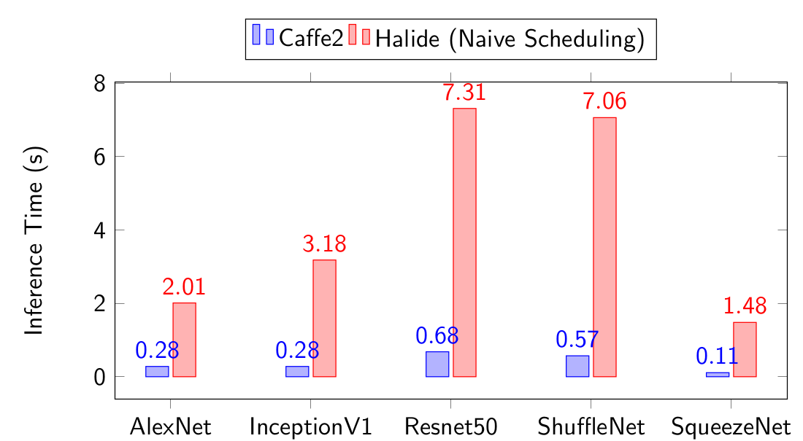

# onnx-halide: A Halide backend for ONNX
This tool converts ONNX neural networks to Halide generators. 

## Installation
This tool has three dependencies, `numpy`, `onnx`, and Halide.

`numpy` and `onnx` can be fetched from PyPI.
The following commands will install the module.
``` 
pip3 install numpy onnx
git clone https://github.com/jerryz123/onnx-halide.git
cd onnx-halide
pip3 install -e .
```

Halide can be built from source, or fetched from a nightly build. 
Either way, `HALIDE_ROOT_DIR` should point to the install directory for Halide.

### Installing Halide from source
Follow instructions at [https://github.com/halide/Halide](https://github.com/halide/Halide)

### Installing Halide from nightly
Fetch and extract correct version from [https://buildbot.halide-lang.org/](https://buildbot.halide-lang.org/). Check your `gcc` version matches.

Set `HALIDE_ROOT_DIR` to installation directory.

### Installing Caffe2
To run comparisons against a reference Caffe2 backend, [install PyTorch+Caffe2](https://caffe2.ai/docs/getting-started.html?platform=ubuntu&configuration=prebuilt). This is only required for running `scripts/test_model.py`.

## Testing
This tool can be verified using the ONNX backend regression suite.
Most operators, and all full-model tests pass. 

`python3 scripts/test_onnx_backend.py`

## Usage
This tool follows the standard usage convention for ONNX backends.
Load an onnx model with `onnx_halide.backend.prepare`.
```
import onnx
import onnx_halide.backend as backend

model = onnx.load("model.onnx")
prepared = backend.prepare(model)
```
The bulk of the work performed by the tool is in `backend.prepare`.
Intermediate files are placed in a `generated/` directory. 
The order of operations performed in this function is as follows.

1. Preprocess the ONNX operator graph, performing shape and type inferencing for all intermediate tensors.
2. Generate source code for a Halide generator that represents the ONNX graph. This will appear as `halogen_generator.cpp`. An example of what this code looks like can be seen [here](https://gist.github.com/jerryz123/525336f72aedea651a5e91f0a2fbd021)
3. Compile `halogen_generator.cpp` with `libHalide.a` to output a Halide generator binary, `halogen.generator`
4. Execute `halogen.generator`, targeting CPU, and generate `halogen.a` and `halogen.h`. These contain the actual executable code for the neural network
5. Generate a C interface function to the generated pipeline as `halogen_c.cpp`, and link with `halogen.a` to produce a shared object file `lib<model_name>.so`.
6. Link `lib<model_name>.so` into Python using `ctypes`, to provide a Python interface to the compiled pipeline.

At this point `prepared.run` will accept inputs to the model as Numpy arrays, execute the model on these inputs, and return the output as Numpy arrays.
```
results = prepared.run(inputs)
```

An example script to show complete usage of this tool on models from the [ONNX model zoo](https://github.com/onnx/models) is at `scripts/test_models.py`.

### Intermediate files
While it is possible to use this tool end-to-end in only Python, the intermediate files of the tool may be useful for certain applications.

`halogen_generator.cpp` contains human-readable source code for a Halide generator, with comments and annotations indicating the operators of the model, their inputs, and the results of shape and type inference. While the end-to-end system just compiles this file, the source code for the generator may be useful for other applications, such as hardware synthesis or autoscheduling.

`halogen.generator` is an executable Halide generator. The end-to-end system executes this binary with the `target=host-no_asserts -e h,static_library` flags. Executables can be generated for other supported targets manually by changing the `target` flag, and the generated code can be emitted as other forms by changing the `-e` flag. Note that `no_asserts` is necessary due to poor runtime of assertion generation in Halide.

`halogen.a` and `halogen.h` is the static library with the generated Halide pipeline output by `halogen.generator`. The end-to-end system compiles these into a shared library so they can be linked into Python. However, the library can be linked with by any C code, and the generated function as defined in `halogen.h` can be called.

## Design
This section serves to document some of the design decisions that went into the current iteration of the generator, and also to provide some guidelines for implementing future ONNX operators.

### Procedure
In the `HalideBackendRep` class, the following procedure is carried out over the ONNX graph to generate the Halide generator source code.

1. For every input Tensor of the graph, record its name, type, and shape in a `HalideObj`.
2. For every output Tensor of the graph, record its name, type, and shape in a `HalideObj`.
3. For every intermediate Tensor of the graph, record its name in a `HalideObj`. Now the collection of `HalideObj` contains all Funcs which may be used in the pipeline.
4. For every operator in the graph, infer the types and shapes of its output tensors, if they have not already been defined.
5. For every operator in the graph, generate the algorithm code


### Operator Generators
ONNX operator nodes have a one-to-one correspondence with `NodeGenerators` in this utility. The `NodeGenerator` is responsible for decoding the ONNX operator's attributes, inferring the types and shapes of it's output tensors, and generating the algorithm and scheduling code for that specific operator. The base definition of this class is as below:
```
class NodeGenerator:
  op_type     = "NONE"
  attr_fields = {}
  def infer_types(self):
    for op in self.ops:
      op.set_type(self.ip0.type)
  def infer_shapes(self):
    for op in self.ops:
      op.set_shape(self.ip0.shape)
  def generate_alg(self, dim_vars):
    raise NotImplementedError
  def generate_sched(self):
    for op in self.ops:
      self.generate_compute_root(op)
```
Child classes are meant to override these functions and attributes. For example, consider the `GEMMGenerator`
```
class GemmGenerator(NodeGenerator):
    op_type = "Gemm"
    attr_fields = {"alpha" :("alpha","f",1),
                   "beta"  :("beta","f",1),
                   "transA":("transA","i",0),
                   "transB":("transB","i",0)}
    def infer_shapes(self):
        self.Y.set_shape([self.M_, self.N_])
    def generate_alg(self, dim_vars):
      ...
```
Setting `op_type = "Gemm"` will associate this `NodeGenerator` with all Gemm operators in the ONNX model. The operator attributes here `alpha, beta, transA, transB`, are described as part of the ONNX node, and their defaults are presented here.
Type inference is the same as the base class, but shape inference is different, since the output tensor shape is not the same as the input tensor shape. The algorithm generation code is also specified.

### Type and Shape Inference
The type of the output tensor is almost always the type of the input tensor, except for very specific operators, like Cast, ArgMax/Min, Shape, and BinOps.

Shape inference is typically trickier, due to the availability of multi-dimensional broadcasting for certain classes of operators. For instance, a tensor of shape [1, 3, 5] can be added to a tensor of shape [2, 3, 1] to output a tensor of shape [2, 3, 5]. The output shape must for these operators be carefully determined from the input shapes.

In any case, the output shape and type are set in `HalideObj.set_shape(shape)` and `HalideObj.set_type(type)`. For both methods, two guarantees are provided.
 - A `HalideObj` can only have its type and shape set once during code generation.
 - If a `HalideObj` is an output Func with its type and shape pre-specified, the inferred type and shape must match what was specified. This validates the type and shape inference.

### Algorithm Generation
`NodeGenerator.generate_alg(dim_vars:list of var)` generates `cpp` source code for one instance of an operator. `dim_vars` represent the Halide Vars used to index the output Func. These are passed in from the top to avoid having to instantiate a new set of Vars for every node in the graph.

Generating the algorithms typically follows a common pattern. The output Func, indexed using the `dim_vars` is assigned some expression of input Funcs indexed using a combination of `dim_vars`, reduction variables, and constants. The majority of the work is determining the right hand expression and the expressions used to index into input Funcs. 

Some useful helper generators include:
 - `NodeGenerator.generate_rdom(name:str, extents:list of (int, int)) -> list of var`
    
    This function generates a reduction domain over the given extents, and returns a list of reduction variables.
    
 - `NodeGenerator.generate_funcref(func:HalideObj, dim_vars:list of var) -> expr`
    
    This function generates an expression that is indexing into a function, i.e. `f(d1, d0)`.

 - `NodeGenerator.generate_asn(op:HalideObj, op_vars:list of var, ip:expr)`

    This function generates the assignment `op(*op_vars) = ip`.
    
**Note: Although Halide dimensions are reversed compared to Numpy dimensions, this generator uses Numpy-style shapes, and the reversal of index variables happens without manual intervention. This explains why generated expressions will display reversed variables, as in `f(d3, d2, d1, d0)`.**

As an example, consider the MatMul operator, in the case with no broadcasting.
```
    def generate_alg(self, dim_vars):
        K = self.ip0.shape[-1]
        red_var = self.generate_rdom("r", [(0, K)])[0]
        a_vars  = [dim_vars[0], red_var]
        b_vars  = [red_var, dim_vars[1]]
        op_expr = "sum({}*{})".format(
                     self.generate_funcref(self.ip0, a_vars),
                     self.generate_funcref(self.ip1, b_vars))
        self.generate_asn(self.op0, dim_vars, op_expr)
```
Here, we get the reduction variable over the K dimension, and create sets of indices into the input A and B arrays.
The output expression is then a reduced sum over a multiply between the input expressions.
If the Tensors were `A, B, C`, and the `dim_vars` were `[d0, d1]`, and the `K` dimension had size `10`, the output code would be:
```
RDom r(0, 10);
C(d1, d0) = sum(A(r[0], d0) * B(d1, r[0]));
```
### Operator Categories
Some of the ONNX operators fall into categories. These categories roughly correspond to the `NodeGenerator` class hierarchy. For example, all binary operators inherit the shape inference and expression formation from the `BinaryGenerator` class.
#### Unary Operators
Unary operators are very simple, with only one input Tensor, and trivial shape inference. These cover the class of activation functions. As seen below, inheritors of this class just need to override a format string.
```
class UnaryGenerator(NodeGenerator):
    def generate_alg(self, dim_vars):
        ip0_expr  = self.generate_funcref(self.ip0,
                                          dim_vars)
        unop_expr = self.expr.format(ip0_expr)
        self.generate_asn(self.op0, dim_vars, unop_expr)
class AbsGenerator(UnaryGenerator):
    op_type = "Abs"
    expr    = "abs({})"
```

#### Binary Operators
Binary operators represent operators between two Tensors that support broadcasting. The shape inference for broadcasting follows numpy-style rules. Similar logic is performed in `BinaryGenerator.generate_alg` to determine the correct index variables for each input. In the example below, see how inheritors only need to provide an `op_type` and an `expr` format string.
```
class BinaryGenerator(NodeGenerator):
    def infer_shapes(self):
        dims = max(self.ip0.dims, self.ip1.dims)
        self.op0.set_shape(
            [self.ip1.shape[-i] if i > self.ip0.dims else
             (self.ip0.shape[-i] if i > self.ip1.dims else
              max(self.ip0.shape[-i], self.ip1.shape[-i])) \
             for i in range(1, dims+1)][::-1])
    def generate_alg(self, dim_vars):
        ip0_dim_vars = [(dvar if dim > 1 else "0") for dim, dvar in
                        zip(self.ip0.shape, dim_vars[-len(self.ip0.shape):])]
        ip0_expr     = self.generate_funcref(self.ip0, ip0_dim_vars)
        ip1_dim_vars = [(dvar if dim > 1 else "0") for dim, dvar in
                        zip(self.ip1.shape, dim_vars[-len(self.ip1.shape):])]
        ip1_expr     = self.generate_funcref(self.ip1, ip1_dim_vars)
        expr         = self.expr.format(ip0_expr, ip1_expr)
        self.generate_asn(self.op0, dim_vars, expr)
class AddGenerator(BinaryGenerator):
    op_type = "Add"
    expr    = "{}+{}"
```
#### Pooling
This class covers operators which pool over regions of the spatial dimensions. Currently this include AveragePool and MaxPool. The `PoolGenerator` class calculates generic indices for the input tensor. Inheritors of the `PoolGenerator` clsas only need to override the `generate_rhs` method and apply these indices in some expression.
#### Dimension Pooling
This class covers operators which pool over one entire dimension. Currently this includes Min, Max, Mean, and Sum.
#### Reductions
Reductions are similar to dimension pooling, except ONNX treats their attributes differently. The reductions include L1, L2, LogSum, Max, Mean, Min, Prod, and Sum.
#### Reshaping
Reshapings are an oddity in ONNX. Currently the "shape" input to a Reshape is a Tensor, instead of a statically known value. This is troublesome, since we want all shapes to be inferrable at code generation time. We get around this by allowing reshapes only when the input shape Tensor has an initializer.

## Future work/Notes
### Other devices
Due to time and resource constraints this system was only tested on CPU. However, the pipelines should trivially be compilable for all valid Halide targets.
### Recurrent networks
Ideally, recurrent networks would contain sub-pipelines that are generated separately and called. The current ONNX specification doesn't do a very good job at demarcating subgraphs, so implementing these would be challenging. 
### Dynamic shapes
ONNX allows for tensors with dynamic shapes in the model graph, although this seems to be an unused feature for neural networks. Currently many operators with dynamic shaping, like Tile, are unsupported. There has been some debate in the ONNX community over how dynamic shapes should represented.
### Schedule generation
Currently the scheduling is naive, `compute_root` every output for every operator. The performance is not great, but is within one order of magnitude of state-of-the-art. More intelligent scheduling may be implemented in the future.

### Compilation time
While the generator source code is emitted and compiled instantaneously, running the generator can take upwards of 30 minutes when `no-asserts` is not specified. This is due to an unresolved issue in Halide. In any case, the generated asserts are redundant with asserts built into the Python interface.
### Halide integration
The current implementation recreates much of the Halide IR in order to serialize it as a human-readable pipeline.
Serializing Halide in this way is useful since it provides an escape hatch to allow further modification of the pipeline for various uses, such as autoscheduling or hardware synthesis. However, I would prefer to not recreate the Halide IR within Python, and instead generate Halide code from within Halide. If serialization of pipelines was added Halide, I would reimplement this system more closely tied to Halide.
### Travis testing
An attempt was made to get this working with Travis. The issue seems to be incompatibilities between GCC versions shipped on the Travis machines and the Halide nightly builds. I just need to find a configuration which works.
